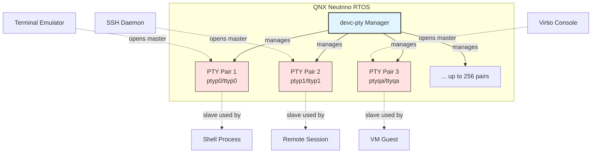
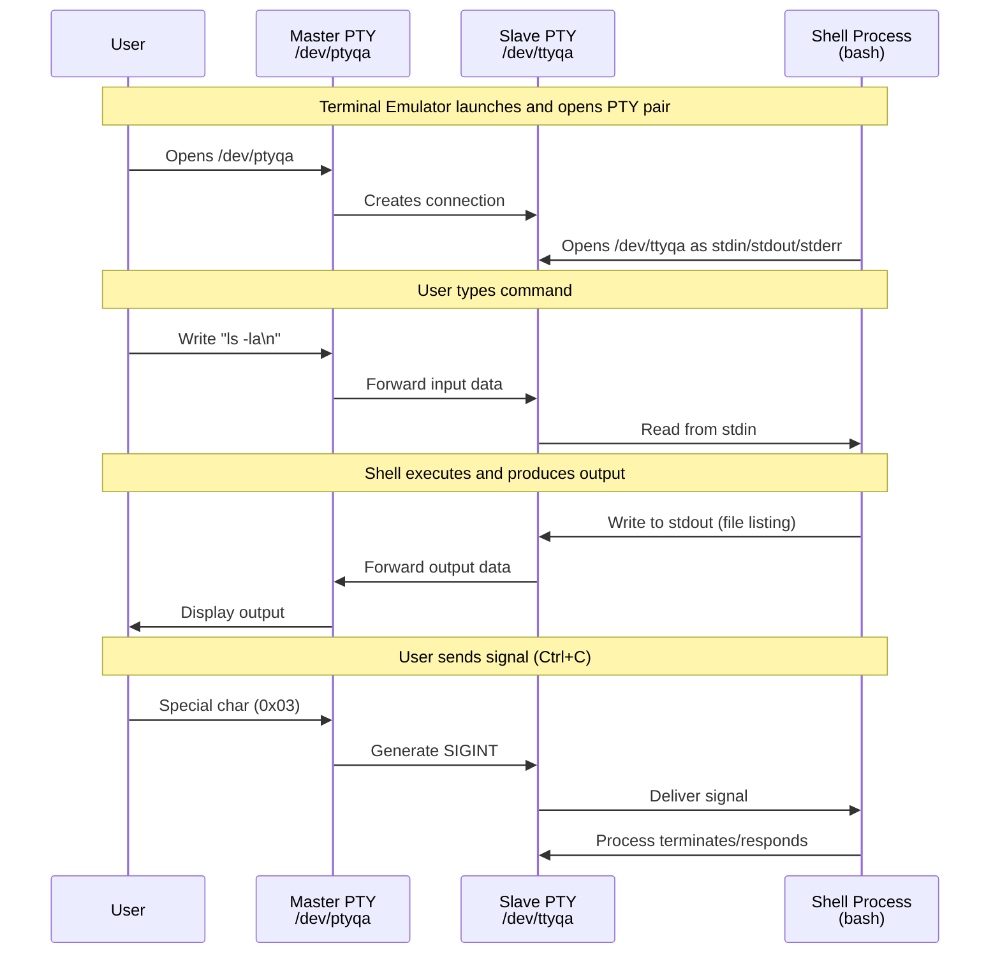

# Understanding Terminal Devices in QNX Neutrino RTOS

## Overview

Terminal handling in QNX Neutrino represents one of the fundamental aspects of process communication and system interaction. While many developers work with terminals daily, the underlying architecture—particularly pseudo-terminal (PTY) implementation—often remains a black box. This document explores how QNX approaches terminal device management, with specific focus on the pseudo-terminal subsystem.

## What Are Terminal Devices?

In Unix-like systems, including QNX Neutrino, terminal devices serve as the interface between user-space processes and the outside world. Originally, these were physical devices (think of the old VT100 terminals), but modern systems predominantly rely on virtual terminal implementations. QNX inherits this design philosophy while adding its own microkernel-specific optimizations.

The concept might seem straightforward at first glance. After all, when you type commands into a shell, you're interacting with a terminal. However, beneath this simplicity lies a sophisticated architecture that handles character buffering, line discipline, signal generation, and session management.

## Pseudo-Terminal Architecture

### The devc-pty Manager

QNX implements pseudo-terminal functionality through the `devc-pty` manager, a lightweight resource manager designed specifically for the QNX Neutrino RTOS. Unlike monolithic operating systems where terminal handling might be deeply embedded in kernel code, QNX follows its microkernel philosophy by implementing this as a separate manager process.

The manager supports up to 256 pseudo-terminal pairs. This limitation isn't arbitrary—it reflects a balance between resource consumption and practical needs for embedded and real-time systems where QNX typically operates.



### Naming Convention

Each pseudo-terminal consists of two endpoints, and QNX follows a systematic naming scheme:

**Master devices** use the pattern: `pty[p-zP-T][0-9a-f]`

**Slave devices** follow: `tty[p-zP-T][0-9a-f]`

The naming might look cryptic initially, but it's methodical. The first character after the prefix spans from 'p' to 'z', then 'P' to 'T' (uppercase). The second character can be any hexadecimal digit (0-9, a-f). This scheme provides the 256 possible combinations needed.

For example, you might encounter device pairs like:
- Master: `/dev/ptyqa`
- Slave: `/dev/ttyqa`

Or another pair:
- Master: `/dev/ptyp0`
- Slave: `/dev/ttyp0`

```
Naming Scheme Breakdown:

  pty[p-zP-T][0-9a-f]     tty[p-zP-T][0-9a-f]
   │    │       │          │    │       │
   │    │       └─────┬────┘    │       └──── Hex digit (16 options)
   │    └─────────────┼─────────┘            0,1,2...9,a,b,c,d,e,f
   │                  │
   │                  └──────────────────── Letter range (16 options)
   │                                        p,q,r,s,t,u,v,w,x,y,z,P,Q,R,S,T
   └─────────────────────────────────────── Prefix identifies device type

Total combinations: 16 × 16 = 256 PTY pairs

Examples:
  ptyp0 ←→ ttyp0    (first pair)
  ptypf ←→ ttypf    (16th pair)
  ptyq0 ←→ ttyq0    (17th pair)
  ptyqa ←→ ttyqa    (26th pair)
  ptyTf ←→ ttyTf    (256th pair, last)
```

## Master and Slave: A Tale of Two Devices

### Master Device Characteristics

The master device represents the controlling side of the terminal. Think of it as the "orchestrator" in the terminal relationship. Applications that need to control or monitor terminal sessions—such as terminal emulators, SSH daemons, or debugging tools—interact with the master side.

What makes the master device special? It can send data that appears as input on the slave side and receive data that applications write to the slave. Beyond simple data transfer, the master can manipulate terminal attributes through `ioctl` operations. This includes setting line modes, adjusting terminal window sizes (crucial for full-screen applications like text editors), and managing various terminal flags.

In practical scenarios, when you launch an SSH session, the SSH daemon opens a master PTY and creates a child process connected to the corresponding slave. Everything you type gets forwarded through the master to the slave, where your shell process reads it.

### Slave Device Behavior

The slave device, on the other hand, appears to applications as a regular terminal. Programs running on the slave side don't need to know they're using a pseudo-terminal rather than a physical one—this transparency is by design.

Applications connected to a slave device can perform standard terminal operations: reading input, writing output, querying terminal capabilities, and setting terminal modes. The slave handles standard streams (stdin, stdout, stderr) just like a physical terminal would. This means your favorite shell, text editor, or command-line tool works identically whether running on a physical console or a pseudo-terminal.

The slave device also maintains proper terminal semantics. Environment variables like `TERM` work as expected, allowing applications to determine terminal capabilities and adjust their behavior accordingly.



## Practical Applications in QNX

### Virtual Console Integration

One particularly interesting use case appears in virtualized environments. QNX supports virtio-console devices, which can be backed by pseudo-terminals. Consider this configuration:

```
vdev vdev-virtio-console.so loc 0x1c090000 intr gic:37 sched 20 hostdev /dev/ptyqa
```

Here, a virtio console device at memory location 0x1c090000 (with interrupt line 37) is backed by the master PTY `/dev/ptyqa`. This allows a virtual machine guest to have a console that's accessible from the host through the corresponding slave device `/dev/ttyqa`.

```
┌─────────────────────────────────────────────────────────────┐
│                        QNX Host System                      │
│                                                             │
│  ┌────────────────┐         ┌──────────────────────────┐  │
│  │ Host Process   │◄────────┤  Master: /dev/ptyqa      │  │
│  │ (can attach)   │ read/   │                          │  │
│  └────────────────┘ write   └──────────┬───────────────┘  │
│                                         │                   │
│                                    PTY Pair                │
│                                         │                   │
│  ┌─────────────────────────────────────▼────────────────┐ │
│  │             Slave: /dev/ttyqa                         │ │
│  │                       ▲                               │ │
│  └───────────────────────┼───────────────────────────────┘ │
│                          │                                  │
│         ┌────────────────┴──────────────┐                  │
│         │ virtio-console device driver  │                  │
│         │ Memory: 0x1c090000            │                  │
│         │ IRQ: GIC:37                   │                  │
│         └────────────────┬──────────────┘                  │
│                          │ virtio transport                │
└──────────────────────────┼─────────────────────────────────┘
                           │
        ═══════════════════╪═══════════════════
                   VM Boundary
        ═══════════════════╪═══════════════════
                           │
┌──────────────────────────▼─────────────────────────────────┐
│                    Virtual Machine Guest                    │
│                                                             │
│  ┌──────────────────────────────────────────────────────┐ │
│  │  Guest Console: /dev/hvc0 or similar                  │ │
│  │  (appears as regular serial console to guest)         │ │
│  └──────────────────┬───────────────────────────────────┘ │
│                     │                                       │
│        ┌────────────▼──────────────┐                       │
│        │  Guest Shell/Applications │                       │
│        │  (bash, login, etc.)      │                       │
│        └───────────────────────────┘                       │
└─────────────────────────────────────────────────────────────┘
```

### Session Detachment with dtach

QNX developers sometimes need to detach from terminal sessions while keeping processes running—similar to GNU screen or tmux on Linux systems. While QNX doesn't include these tools by default, utilities like `dtach` serve a similar purpose:

```
dtach -n /tmp/vmm qtalk -m /dev/ttyq0
```

This command starts `qtalk` (a communication utility) connected to `/dev/ttyq0` (a slave device) while creating a detachable session socket at `/tmp/vmm`. The `-n` flag creates a new session without attaching to it immediately.

Later, you can reattach to this session or leave it running in the background. The slave device `/dev/ttyq0` ensures that `qtalk` has proper terminal semantics even when detached.

```mermaid
graph LR
    subgraph "Before dtach"
        A[User Shell] -->|controls| B[qtalk process]
        B -->|uses| C[/dev/ttyq0]
    end
    
    subgraph "After: dtach -n /tmp/vmm"
        D[dtach daemon] -->|manages| E[/tmp/vmm socket]
        D -->|controls| F[qtalk process]
        F -->|uses| G[/dev/ttyq0]
        H[User Shell] -.->|detached| D
    end
    
    subgraph "Reattach later"
        I[Any Shell] -->|dtach -a| J[/tmp/vmm socket]
        J -->|reconnects| K[qtalk process]
        K -->|uses| L[/dev/ttyq0]
    end
    
    style E fill:#fff3cd,stroke:#856404
    style F fill:#d1ecf1,stroke:#0c5460
    style K fill:#d1ecf1,stroke:#0c5460
```

### Process Communication

Beyond traditional terminal use, pseudo-terminals enable sophisticated inter-process communication patterns. Since both sides support standard file operations (read, write, ioctl), they can serve as bidirectional communication channels with built-in buffering and flow control.

For debugging scenarios, attaching to an application's terminal can provide insights into its behavior without modifying the application itself. This non-intrusive observation capability proves invaluable in real-time systems where timing constraints matter.

```
Process Communication Pattern Using PTYs:

    ┌──────────────┐                      ┌──────────────┐
    │  Process A   │                      │  Process B   │
    │  (Control)   │                      │  (Worker)    │
    └──────┬───────┘                      └──────┬───────┘
           │                                     │
           │ open(/dev/ptyp5, O_RDWR)           │
           ▼                                     │
    ┌─────────────┐                             │
    │  /dev/ptyp5 │◄────────────────────────────┤
    │   (Master)  │         PTY Pair            │
    └──────┬──────┘                             │
           │                                     │
           │                                     │ open(/dev/ttyp5)
           │                                     │ dup2 to stdin/stdout
           │                                     ▼
    ┌──────▼──────┐                      ┌─────────────┐
    │             │                      │  /dev/ttyp5 │
    │  write()    │─────────────────────►│   (Slave)   │
    │             │   "command\n"        └─────────────┘
    └─────────────┘                             │
           ▲                                    │
           │                                    │ read()
           │                                    ▼
           │                             Process B reads
           │                             command as stdin
           │                                    │
           │                                    │ write()
           │                                    ▼
    ┌─────────────┐                      ┌─────────────┐
    │   read()    │◄─────────────────────│  stdout     │
    │             │   "result\n"         │  output     │
    └─────────────┘                      └─────────────┘
           │
           ▼
    Process A receives
    result from Process B

Benefits:
  • Bidirectional communication
  • Built-in line buffering
  • Signal propagation
  • Terminal semantics (Process B sees a "terminal")
  • Flow control handled automatically
```

## Implementation Considerations

### Resource Management

Since QNX targets embedded and real-time systems, resource consumption matters. The 256 PTY limit reflects this reality. Each pseudo-terminal pair consumes kernel resources for buffering, state management, and process bookkeeping. In practice, 256 simultaneous PTY sessions far exceeds the requirements of most embedded applications.

### Scheduling and Priorities

Notice the `sched 20` parameter in the virtio-console example earlier? QNX allows fine-grained control over scheduling priorities. Terminal manager processes can run at specific priority levels, ensuring that terminal I/O doesn't interfere with time-critical tasks. This flexibility distinguishes QNX from general-purpose operating systems.

### Real-Time Constraints

Terminal operations typically aren't time-critical—humans type slowly compared to CPU speeds. However, automated processes using PTYs for inter-process communication might have real-time requirements. QNX's microkernel architecture ensures that terminal operations don't block high-priority real-time tasks, maintaining system determinism.

## Common Patterns and Best Practices

When working with pseudo-terminals in QNX applications, several patterns emerge:

**Opening PTY Pairs**: Unlike some systems that provide `/dev/ptmx` for dynamic PTY allocation, QNX uses explicit device names. Applications typically iterate through available names until finding an unused pair.

**Setting Terminal Attributes**: Use `tcgetattr` and `tcsetattr` functions to configure terminal behavior. Raw mode, canonical mode, echo settings, and special character handling all fall under this umbrella.

**Window Size Management**: Full-screen applications need accurate terminal dimensions. The `TIOCGWINSZ` and `TIOCSWINSZ` ioctl operations handle window size queries and updates. When a terminal window resizes, sending `SIGWINCH` to processes allows them to adapt.

**Process Groups and Sessions**: Proper terminal session management requires understanding process groups. The controlling terminal concept determines which process receives signals like SIGINT (Ctrl+C) or SIGTSTP (Ctrl+Z).

## Debugging Terminal Issues

Terminal problems can be notoriously difficult to debug because they involve multiple layers: application code, terminal discipline, device drivers, and process management. A few techniques help:

Examine open file descriptors with process manager tools to verify which devices a process has open. Check terminal attributes using command-line utilities to ensure they match expectations. Look for orphaned PTY devices that might indicate resource leaks.

Signal delivery issues often relate to process group membership. Verify that processes belong to the correct session and process group for their terminal. The `ps` command with appropriate options shows these relationships.

## Looking Forward

As embedded systems grow more sophisticated, terminal handling evolves too. Container technologies, virtualization, and distributed systems all rely on robust pseudo-terminal implementations. QNX's design—with its microkernel architecture and resource manager approach—provides flexibility for these emerging use cases while maintaining the reliability expected in mission-critical systems.

Understanding terminal devices might seem like arcane knowledge in an era of graphical interfaces and web applications. Yet these foundations remain relevant. Every time you SSH into a remote system, debug a headless embedded device, or automate tasks through scripted terminal interactions, you're leveraging the pseudo-terminal subsystem.

## Summary

QNX Neutrino's approach to terminal management exemplifies the operating system's broader design philosophy: keep components modular, maintain clear interfaces, and prioritize reliability. The `devc-pty` manager provides up to 256 pseudo-terminal pairs through a systematic naming scheme, supporting everything from basic command-line interaction to complex virtualization scenarios.

Whether you're developing terminal emulators, building automation tools, or integrating QNX into larger systems, understanding the PTY architecture helps you make informed design decisions. The master-slave device model, while simple in concept, enables powerful patterns for process communication and control.

In real-time and embedded contexts where QNX excels, these capabilities become even more critical. Terminal interfaces often serve as the primary means of system interaction during development, debugging, and maintenance. Getting them right—understanding their behavior, limitations, and possibilities—separates robust implementations from brittle ones.
